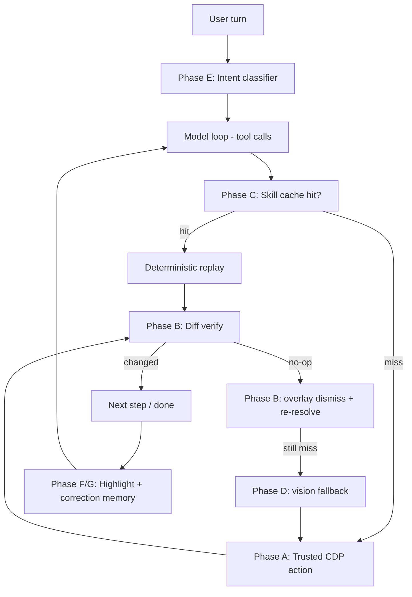

# Navio agent core — smarter than Comet / Atlas, reliably clicks

**Status:** **Partially implemented** (trusted CDP click/type, verify-after-click/type, overlay dismiss, pre-click occlusion gate, per-frame AX tree, persistent debugger when monitoring). Remaining: vision fallback, highlight overlay, full skills replay in main, benchmark suite.
**Related:** [TRUE_BROWSER_IMPLEMENTATION_PLAN.md](./TRUE_BROWSER_IMPLEMENTATION_PLAN.md), [COMPETITIVE_GAPS_AND_PLAN.md](./COMPETITIVE_GAPS_AND_PLAN.md).

## TL;DR

Rebuild the Navio agent's action layer around first-party Chrome DevTools Protocol (CDP) primitives — trusted pointer events, occlusion-aware targeting, diff-based verification, shadow-DOM piercing, fingerprint-based re-resolve, skill cache, vision fallback — plus an intent classifier and a live "agent is driving" UX.

Net result: the agent clicks the right thing on sites Comet and Atlas flake on, verifies every action actually worked, remembers what worked last time, and only says "I can't click here" as a true last resort.

## To-do checklist

- [x] **Phase A** — Trusted CDP input (`Input.dispatchMouseEvent`, `Input.dispatchKeyEvent` in `typeByRef`), multi-frame `Accessibility.getFullAXTree`, persistent debugger when `getAccessibilityTreeOnce` / inspector attaches ([electron/a11y-tree.js](../electron/a11y-tree.js)). Shadow pierce / deeper AX options still incremental.
- [x] **Phase B** — Verify-after-action via [electron/navio-agent-verify.js](../electron/navio-agent-verify.js) + [electron/main.js](../electron/main.js) `click` / `type_text` (ref paths); overlay dismiss on no-op click; `wait_for_idle`; **pre-click occlusion** via shared `checkOcclusion` before trusted click.
- [ ] **Phase C** — Stable element fingerprints in ref map; **`navio-skills.js` not wired into main** — use **saved workflows** ([electron/navio-workflows.js](../electron/navio-workflows.js)) for explicit replay instead (see [COMPETITIVE_GAPS_AND_PLAN.md](./COMPETITIVE_GAPS_AND_PLAN.md)).
- [ ] **Phase D** — Vision fallback tool (numbered-box screenshot overlay, wired into the retry ladder as last resort).
- [x] **Phase E** — Intent signals: [src/js/navio-intent-router.js](../src/js/navio-intent-router.js) used from assistant (regex classifier); full replacement of `_buildConnectorContext` heuristics not required for parity.
- [ ] **Phase F** — Live highlight overlay in the guest page + user-correction store for fingerprint overrides.
- [ ] **Phase G** — "Agent is driving" status bar + tier-2 action cards with element thumbnail + optional PiP viewport.
- [ ] **Benchmark** — Agent benchmark suite (Stripe checkout, Cloudflare, cookie-banner sites, shadow-DOM SPAs, React Select, Expedia multi-step, Gmail) run before/after every phase.

## Why this works (the "thing they aren't doing")

Comet and Atlas run agent loops **from outside Chromium** (extension bridge / remote CDP) and use synthetic DOM `.click()` or pure pixel-screenshot coordinate clicks. Both strategies have well-known failure modes:

- Synthetic `.click()` is rejected by `isTrusted` guards on payment forms, Cloudflare challenges, React Select menus, many auth flows.
- Pure pixel clicks are expensive (screenshot per step), slow, and lose the DOM semantics that would tell them a modal just appeared.

Navio is **the Chromium host**. We can dispatch real `Input.dispatchMouseEvent` events (same trust level as a human cursor), read `DOM.getBoxModel` + `elementFromPoint` to check occlusion before firing, subscribe to `Page.lifecycleEvent` / `Network.*` / `DOM.childNodeInserted` for verification diffs, and pierce shadow roots on the same CDP channel. No external agent framework can do this without the level of access we already have in [electron/a11y-tree.js](../electron/a11y-tree.js) and [electron/cdp-inspector.js](../electron/cdp-inspector.js).

That is the differentiator. Everything below is how we spend it.

## Current state (verified in code on 2026-05)

| Area            | Today                                                                                                                                                       | Gap                                                                 |
| --------------- | ----------------------------------------------------------------------------------------------------------------------------------------------------------- | ------------------------------------------------------------------- |
| Click primitive | Trusted `Input.dispatchMouseEvent` from box center; fallback `element.click()` when no box ([electron/a11y-tree.js](../electron/a11y-tree.js) `clickByRef`) | Rare off-tree targets; some canvas-only UIs still need xy         |
| Typing          | Focus via trusted click + `Input.dispatchKeyEvent` / `insertText` + React value setter ([electron/a11y-tree.js](../electron/a11y-tree.js) `typeByRef`)       | Some custom editors still awkward                                   |
| Targeting       | `ref_N` from multi-frame AX tree; text/aria/xy fallbacks in tools                                                                                          | Refs go stale on SPA re-render; fingerprint replay not productized |
| Verification    | `snapshotPage` + `verifyAction` after ref **click** and **type_text**; `no_change_warning` / `page_change` ([electron/main.js](../electron/main.js))         | Non-ref click/type paths use older executor without same diff       |
| Shadow DOM      | Per-frame AX trees aggregated in `getAccessibilityTreeOnce`                                                                                                 | Pierce depth / shadow quirks on some apps                           |
| Occlusion       | `checkOcclusion` before trusted click returns `occluded_by` for overlay-like top hitters                                                                     | Heuristic may miss novel overlay patterns                           |
| Intent routing  | `NavioIntentRouter` + assistant toggles / `_buildConnectorContext`                                                                                            | Regex misses edge phrasing until expanded                           |
| Skill memory    | **Workflows** (named tool-step lists) + UI in palette / toolbar / assistant; `navio-skills.js` exists but **not** imported in main                        | Auto-learned skill replay not integrated                            |
| UX              | Tiered confirmations, ledger; no live “about to click” highlight yet                                                                                       | Phase F/G                                                           |

## Architecture



## Phase A — Trusted input core (the foundation)

**Exit criterion:** Navio clicks work on Stripe's test checkout, Cloudflare challenges, and `document.addEventListener('click', e => e.isTrusted && ...)` test pages where Comet/Atlas demos fail.

- Replace `this.click()` in `clickByRef` ([electron/a11y-tree.js:277-285](../electron/a11y-tree.js)) with:
  1. `DOM.scrollIntoViewIfNeeded({ backendNodeId })`
  2. `DOM.getBoxModel({ backendNodeId })` -> compute viewport-center `(cx, cy)` of the content quad
  3. `Input.dispatchMouseEvent({ type: 'mousePressed', x, y, button: 'left', clickCount: 1, buttons: 1 })`
  4. `Input.dispatchMouseEvent({ type: 'mouseReleased', x, y, button: 'left', clickCount: 1 })`
- Add `Input.dispatchKeyEvent` (rawKeyDown + char + keyUp) to `typeByRef` for React-controlled inputs that gate on `keydown`/`keyup` ([a11y-tree.js:303-342](../electron/a11y-tree.js)). Keep `Input.insertText` as the bulk-text path.
- Shadow-DOM piercing: switch `buildYamlTree` in [a11y-tree.js:90](../electron/a11y-tree.js) to request `Accessibility.getFullAXTree({ depth: -1 })` and traverse `frameId` boundaries; use `DOM.querySelector({ pierce: true })` when resolving text/aria fallbacks.
- Persistent debugger attach: today [a11y-tree.js](../electron/a11y-tree.js) attaches/detaches per call. Move to per-tab persistent attach (piggyback on [cdp-inspector.js:29](../electron/cdp-inspector.js) `startMonitoring`) with a single `.detach()` on tab close. Cuts ~80ms per action.

## Phase B — Verify-after-action loop (kills "I clicked but nothing happened")

**Exit criterion:** after every `click` / `type_text`, the tool result includes a compact change signal; on no-op, the agent auto-retries before surfacing failure.

- Pre-click: snapshot `{url, activeElementPath, mutationCounter, lastNetworkReqId}` via `Runtime.evaluate` + `cdp-inspector` network buffer.
- Click/type (Phase A trusted path).
- Occlusion check: `Runtime.evaluate({ expression: 'document.elementFromPoint(x, y)' })` on the pre-computed center — if the returned node is not the target or an ancestor, abort click, return `{ occluded_by: <role+name> }` to the agent.
- Post-click (within 800 ms): diff snapshot. Push a structured result to the model:
  ```json
  {"success": true, "url_changed": false, "dom_mutations": 14,
   "new_interactive": ["Confirm", "Cancel"], "network_fired": 2,
   "console_errors": []}
  ```
- Built-in retry ladder when diff = zero:
  1. Dismiss-overlay heuristic: look for `[aria-label~=close]`, `[aria-label~=dismiss]`, visible `x` button within 400 px of viewport center; press Escape as last resort.
  2. Refresh a11y tree, re-resolve by fingerprint (Phase C).
  3. Escalate to vision (Phase D).
- New primitive `wait_for_idle(timeout_ms)`: polls `Network` quiescence (no request in flight) + no DOM mutations for N ms. Replaces arbitrary `wait(3000)` in [navio-tools.js:264](../electron/navio-tools.js).

## Phase C — Stable fingerprints + skill cache (replayable flows)

**Exit criterion:** the second time the agent does a familiar task on a known URL pattern, it calls the model fewer than 30% as often and finishes in under half the wall-clock.

- Extend ref entry in [a11y-tree.js:15-17](../electron/a11y-tree.js) from `{backendDOMNodeId, role, name}` to `{backendDOMNodeId, role, name, fingerprint}` where fingerprint is:
  ```
  {role, name, textPrefix(40), siblingIndex, ariaLabel,
   dataTestId, cssSelector, frameIdChain}
  ```
- New exported helper `resolveByFingerprint(wc, fp)` — tries each axis in order; ref is just a short alias.
- Skill format, stored at `<userData>/navio-skills/<sha1(urlPattern)>.json`:
  ```json
  {"goal": "Book economy round-trip on Expedia",
   "url_pattern": "https://www.expedia.com/Flights-*",
   "goal_embedding": [/*...*/],
   "steps": [
     {"action": "click", "fingerprint": {/*...*/}},
     {"action": "type", "fingerprint": {/*...*/}, "value_template": "{origin}"}
   ],
   "success_signal": {"url_matches": "/booking/confirmation"},
   "last_verified": "2026-04-20T12:34:56Z"}
  ```
- New orchestration module `electron/navio-skills.js` with `findSkill(goal, url)`, `replaySkill(skill, params)`, `recordSkill(goal, url, actionLog)`.
- Hook into the tool loop in [electron/main.js](../electron/main.js): before calling the model, look up skill; on miss, run model as today and record on success.

## Phase D — Vision fallback (only when needed, to save tokens)

**Exit criterion:** when Phases A–C all fail to resolve a target, the agent uses a screenshot + numbered-box overlay to disambiguate instead of giving up.

- New tool `locate_visually(target_description)`:
  1. `Page.captureScreenshot({ clip: viewport, format: 'jpeg', quality: 70 })`
  2. Renders numbered bounding boxes around all currently-known interactive a11y nodes onto the image (server-side with a tiny canvas — no extra provider call)
  3. Sends to a vision-capable model (OpenAI `gpt-4o`, Anthropic `claude-sonnet-4`, Google `gemini-2.5-pro`) with the target description
  4. Model returns a number; we map back to fingerprint and click via Phase A trusted path
- Wires into the Phase B retry ladder as step 3 only. Never called eagerly (token cost).
- New config key `agentVisionFallback: 'auto' | 'always' | 'off'` in [electron/config-store.js](../electron/config-store.js), default `'auto'`.

## Phase E — Intent classifier (fixes the "AI didn't check my email" complaint)

**Exit criterion:** the regex pile in [src/js/assistant.js](../src/js/assistant.js) `_buildConnectorContext` is replaced; connector misclassifications drop to near zero on a 50-query benchmark.

- New module `src/js/navio-intent-router.js` that classifies a user turn into one of: `{direct_answer, web_search, browser_action, gmail, calendar, drive, multi, ambiguous}`.
- Implementation: single cheap model call (same provider as main turn, `temperature: 0`, ~100 tokens), cached by `(lastTurn, currentTurnHash)` for 30s.
- Router output feeds connector prefetch + tool hint injection into the main turn.
- Fallback: if classifier unavailable or ambiguous, fall back to current regex path so no regression.

## Phase F — Live highlight + user-correction memory (the UX differentiator)

**Exit criterion:** user can see what the agent is about to click, press Escape to stop, or click the correct element to teach the agent for next time.

- Inject a persistent overlay into the guest page via `Page.addScriptToEvaluateOnNewDocument` (so it survives navigation): a top-layer `<div>` outlining the current target with the planned action as a label ("Click 'Book flight'" / "Typing in 'Email'").
- Escape key on host window cancels the action mid-flight (already have `agent-input-focus.js` hooks we can reuse).
- If the user clicks a different element within 4 s of the highlight appearing, record `{urlPattern, originalFingerprint, correctedFingerprint, timestamp}` to `<userData>/navio-agent-corrections/<sha1(urlPattern)>.json`.
- `resolveByFingerprint` (Phase C) checks the corrections store first — user teaches agent permanently without any training loop.
- Mirror every step as a receipt card in the assistant panel ledger (already partially drawn in [src/js/assistant.js](../src/js/assistant.js) — extend).

## Phase G — "Agent is driving" status bar + confirm cards

**Exit criterion:** user always knows what the agent is doing and can kill or confirm in under 200 ms.

- Top-of-tab status bar (new `.agent-driving-bar` element in [src/index.html](../src/index.html)) with: live step counter `3/12`, current action text, spinner, kill switch.
- Tier-2 confirm dialogs (payments, sends, destructive actions — existing tier system in [electron/navio-tools.js](../electron/navio-tools.js)) styled as action cards with a thumbnail of the highlighted element.
- Optional picture-in-picture of the guest viewport docked in the assistant sidebar so the user can minimize the driving tab but still watch.

## Benchmark / regression suite

- New `test/agent-benchmark/` with ~12 recorded tasks: Stripe test checkout, Cloudflare challenge page, Amazon product-to-cart, Gmail compose+attach+draft, YouTube search-and-click, Reddit post, Notion page create, Linear issue create, Expedia flight search, a cookie-banner-heavy news site, a shadow-DOM-heavy SPA, a React Select dropdown.
- Runs each task against `before` and `after` each phase; logs steps, wall-clock, token cost, success.
- Not a public e2e — run locally before each merge.

## Files touched (summary)

- Core: [electron/a11y-tree.js](../electron/a11y-tree.js), [electron/navio-tools.js](../electron/navio-tools.js), [electron/main.js](../electron/main.js), [electron/cdp-inspector.js](../electron/cdp-inspector.js)
- New modules: `electron/navio-skills.js`, `electron/navio-agent-verify.js`, `electron/navio-agent-vision.js`, `src/js/navio-intent-router.js`
- UX: [src/js/assistant.js](../src/js/assistant.js), [src/index.html](../src/index.html), [src/css/styles.css](../src/css/styles.css), [electron/navio-system-prompt.txt](../electron/navio-system-prompt.txt)
- Config: [electron/config-store.js](../electron/config-store.js) (new `agentVisionFallback`, `agentShowHighlight`, `agentSkillCacheEnabled`)
- Docs: [TRUE_BROWSER_IMPLEMENTATION_PLAN.md](./TRUE_BROWSER_IMPLEMENTATION_PLAN.md) checkboxes, new `docs/AGENT_CORE.md`

## Risks & mitigations

- **Debugger single-client rule:** only one client can own `wc.debugger`. Opening DevTools breaks the agent (already true today). Mitigation: clearer error surfaced in assistant ("DevTools is open — close it to resume agent") instead of silent failure.
- **Trusted input bypasses some guardrails:** this is the point, but gate it — only clicks on elements we resolved through the a11y tree or Phase D vision, never blind coordinates from model text.
- **Shadow piercing can 10x the a11y payload** on some sites. Keep `max_chars` cap in [navio-tools.js:158-161](../electron/navio-tools.js) and add per-site pruning heuristics.
- **Skill cache staleness** — sites change. Mitigation: `success_signal` is checked every replay; on miss, discard cached skill and fall back to model. Re-record on next success.
- **Corrections store privacy** — stored locally, scoped to URL pattern, encrypted under the existing Navio profile key.
- **Token cost of intent classifier** — 100 tokens x N turns. Cache + `temperature: 0` + only classify when the user turn is ambiguous keeps this negligible.

## Sequencing

- **Phase A + B** merge together — A without B is unsafe (agent clicks trusted events without checking they landed).
- **Phase C** next — skill cache needs Phase A/B reliability or it caches failures.
- **Phase D** standalone — can land after C or in parallel.
- **Phase E** standalone — can land any time, high-ROI solo ship.
- **Phase F** depends on A/B/C (needs fingerprints + verify) and C (for corrections store).
- **Phase G** depends on F (shared highlight machinery).

Quick-win ship order: `A+B` -> `E` (parallel) -> `C` -> `F+G` -> `D`.

## Out of scope (explicit)

- Training our own click-prediction model — we use the user's already-configured LLM via the existing multi-provider layer.
- Full Puppeteer / Playwright replacement — we stay on Electron's first-party debugger API.
- Any feature that silently sends email or pays money without tier-2 confirm (Navio's safety thesis, [COMPETITIVE_GAPS_AND_PLAN.md](./COMPETITIVE_GAPS_AND_PLAN.md)).
- Chat-page NTP redesign — separate plan.

## How to use this doc in a new agent chat

Paste this into the new chat:

> Read `docs/AGENT_CORE_PLAN.md`, `docs/TRUE_BROWSER_IMPLEMENTATION_PLAN.md`, and `docs/COMPETITIVE_GAPS_AND_PLAN.md`. Then execute Phase A + B as one PR-sized slice, following the Navio cardinal rules (stability first, minimal invasive, no mock data, preserve existing tool signatures). Run the benchmark suite before and after. Report deltas.

---

*Last updated: 2026-04-20.*
